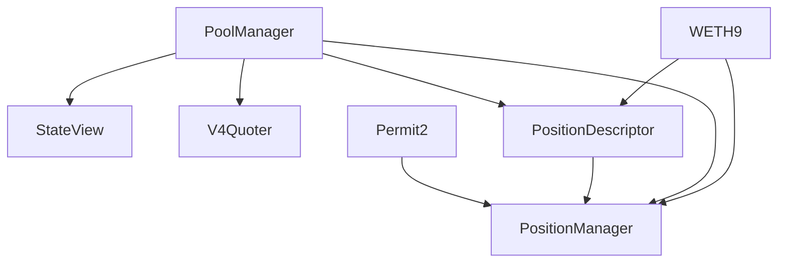

# Contract Analysis

Comprehensive analysis of Uniswap V4 contracts and their dependencies.

## Contract Overview

| Contract | Type | Dependencies | Purpose |
|----------|------|--------------|---------|
| PoolManager | Core | None | Manages all pools, swaps, and liquidity |
| Permit2 | Utility | None | Token approvals and signature-based transfers |
| StateView | Lens | PoolManager | Reads pool state offchain |
| V4Quoter | Lens | PoolManager | Provides swap quotes |
| PositionDescriptor | Peripheral | PoolManager, WETH9 | NFT metadata generator |
| PositionManager | Peripheral | PoolManager, Permit2, PositionDescriptor, WETH9 | Main liquidity management interface |

---

## 1. PoolManager

**File:** `contracts/core/PoolManager.sol`

**Inheritance Chain:**
```
IPoolManager
  ↓
ProtocolFees
  ↓
Extsload
  ↓
Exttload
  ↓
NoDelegateCall
  ↓
ERC6909Claims
  ↓
PoolManager
```

**Constructor:**
```solidity
constructor(address initialOwner) ProtocolFees(initialOwner) {}
```

**Key Features:**
- Central registry for all liquidity pools
- Handles swaps, liquidity additions/removals
- Manages protocol fees
- Uses ERC-6909 for internal token accounting
- Implements transient storage for gas optimization
- No delegate calls allowed for security

**Storage:**
- Pool state (Slot0, liquidity, ticks)
- Position data
- Fee configuration
- Currency reserves

**Critical Functions:**
- `initialize()` - Create new pools
- `swap()` - Execute token swaps
- `modifyLiquidity()` - Add/remove liquidity
- `unlock()` - Enable batch operations
- `settle()` / `take()` - Token transfers

**Dependencies:** None (core contract)

**Gas Optimizations:**
- Transient storage for temporary state
- Packed storage for Slot0
- Bitpacking for tick data
- Custom revert for error handling

---

## 2. Permit2

**File:** `contracts/periphery/utils/permit2/Permit2.sol`

**Inheritance Chain:**
```
SignatureTransfer
  ↓
AllowanceTransfer
  ↓
Permit2
```

**Constructor:**
```solidity
// No constructor parameters
contract Permit2 is SignatureTransfer, AllowanceTransfer {}
```

**Key Features:**
- Unifies EIP-2612 signature permits and traditional allowances
- Gas-efficient batch approvals and transfers
- Nonce management for replay protection
- Expiration support for approvals

**Storage:**
- Allowances (owner → spender → token → amount)
- Nonces for signature validation
- Permit details with expiration

**Critical Functions:**
- `approve()` - Set allowances
- `permit()` - Signature-based approvals
- `transferFrom()` - Execute transfers
- `permitTransferFrom()` - Signature-based transfers

**Dependencies:** None (utility contract)

**Security Features:**
- Nonce tracking prevents replay attacks
- Expiration timestamps
- EIP-712 typed data signing
- Witness data support for additional context

---

## 3. StateView

**File:** `contracts/periphery/lens/StateView.sol`

**Inheritance Chain:**
```
ImmutableState
  ↓
IStateView
  ↓
StateView
```

**Constructor:**
```solidity
constructor(IPoolManager _poolManager) ImmutableState(_poolManager) {}
```

**Key Features:**
- View-only contract for reading pool state
- Wraps StateLibrary for convenient access
- Designed for offchain clients
- No state modifications

**Read Functions:**
- `getSlot0()` - Current price, tick, fees
- `getTickInfo()` - Tick liquidity and fees
- `getTickLiquidity()` - Liquidity at specific tick
- `getTickFeeGrowthOutside()` - Fee accumulation
- `getFeeGrowthGlobals()` - Global fee tracking
- `getLiquidity()` - Current pool liquidity
- `getPositionInfo()` - Position data
- `getPositionLiquidity()` - Position liquidity amount

**Dependencies:**
- PoolManager (address stored immutably)
- StateLibrary (for state access)

**Use Cases:**
- Frontend queries
- Analytics dashboards
- Offchain price calculations
- Position value estimation

---

## 4. V4Quoter

**File:** `contracts/periphery/lens/V4Quoter.sol`

**Inheritance Chain:**
```
BaseV4Quoter
  ↓
IV4Quoter
  ↓
V4Quoter
```

**Constructor:**
```solidity
constructor(IPoolManager _poolManager) BaseV4Quoter(_poolManager) {}
```

**Key Features:**
- Simulates swaps without executing
- Returns expected output amounts
- Gas estimation for transactions
- Multi-hop swap support
- Uses try-catch to extract results

**Quote Functions:**
- `quoteExactInputSingle()` - Single pool exact input
- `quoteExactInput()` - Multi-hop exact input
- `quoteExactOutputSingle()` - Single pool exact output
- `quoteExactOutput()` - Multi-hop exact output

**Dependencies:**
- PoolManager (for state access)
- QuoterRevert library (for result extraction)
- Locker library (for msg.sender context)

**Important Notes:**
- Functions are NOT view (they revert to return data)
- NOT gas efficient - offchain use only
- Never call from smart contracts
- Used for frontend price quotes

**How It Works:**
1. Calls `poolManager.unlock()` with quote params
2. Simulates swap in callback
3. Reverts with result data
4. Extracts result from revert reason
5. Returns amount and gas estimate

---

## 5. PositionDescriptor

**File:** `contracts/periphery/PositionDescriptor.sol`

**Inheritance Chain:**
```
IPositionDescriptor
  ↓
PositionDescriptor
```

**Constructor:**
```solidity
constructor(
    IPoolManager _poolManager,
    address _wrappedNative,
    bytes32 _nativeCurrencyLabelBytes
) {
    poolManager = _poolManager;
    wrappedNative = _wrappedNative;
    nativeCurrencyLabelBytes = _nativeCurrencyLabelBytes;
}
```

**Key Features:**
- Generates NFT metadata for positions
- Creates visual SVG representations
- Provides human-readable descriptions
- Token0/token1 information
- Price range display

**Storage:**
- `poolManager` - Immutable reference
- `wrappedNative` - WETH address for native token display
- `nativeCurrencyLabelBytes` - Label (e.g., "ETH")

**Functions:**
- `tokenURI()` - Generate full NFT metadata JSON
- `nativeCurrencyLabel()` - Get currency label as string

**Dependencies:**
- PoolManager (for position data)
- WETH9 address (for native token handling)

**Metadata Output:**
```json
{
  "name": "Uniswap - 0.3% - USDC/ETH - 1500<>2000",
  "description": "Position in USDC/ETH pool...",
  "image": "data:image/svg+xml;base64,...",
  "attributes": [...]
}
```

---

## 6. PositionManager

**File:** `contracts/periphery/PositionManager.sol`

**Inheritance Chain:**
```
BaseActionsRouter
  ↓
Permit2Forwarder
  ↓
ERC721Permit_v4
  ↓
Notifier
  ↓
NativeWrapper
  ↓
PositionManager
```

**Constructor:**
```solidity
constructor(
    IPoolManager _poolManager,
    IAllowanceTransfer _permit2,
    uint256 _unsubscribeGasLimit,
    IPositionDescriptor _tokenDescriptor,
    IWETH9 _weth9
)
    BaseActionsRouter(_poolManager)
    Permit2Forwarder(_permit2)
    ERC721Permit_v4("Uniswap v4 Positions NFT", "UNI-V4-POSM")
    Notifier(_unsubscribeGasLimit)
    NativeWrapper(_weth9)
```

**Key Features:**
- NFT-based liquidity positions (ERC-721)
- Integrated Permit2 support
- Native ETH wrapping/unwrapping
- Hook notifications for position changes
- Multicall support for batching
- Slippage protection

**Core Functions:**

**Position Management:**
- `mint()` - Create new position
- `increaseLiquidity()` - Add liquidity to position
- `decreaseLiquidity()` - Remove liquidity from position
- `burn()` - Close position and burn NFT
- `collect()` - Collect fees

**Token Operations:**
- `settle()` - Deposit tokens
- `take()` - Withdraw tokens
- `settleAndTake()` - Combined operation

**Advanced Features:**
- `subscribe()` - Enable hook notifications
- `unsubscribe()` - Disable notifications
- `permit()` - Gasless approvals
- `multicall()` - Batch operations

**Dependencies:**
- PoolManager (for pool interactions)
- Permit2 (for token approvals)
- PositionDescriptor (for NFT metadata)
- WETH9 (for native ETH handling)

**Gas Optimizations:**
- Packed position data
- Transient storage for deltas
- Multicall batching
- Efficient token accounting

**Security Features:**
- Reentrancy guards
- Slippage checks
- Deadline validation
- Safe callback pattern

---

## Deployment Dependencies



**Deployment Order:**
1. PoolManager (independent)
2. Permit2 (independent)
3. WETH9 (independent, or use existing)
4. StateView (requires PoolManager)
5. V4Quoter (requires PoolManager)
6. PositionDescriptor (requires PoolManager, WETH9)
7. PositionManager (requires all above)

---

## Constructor Parameter Summary

| Contract | Parameters | Types |
|----------|-----------|-------|
| PoolManager | initialOwner | address |
| Permit2 | (none) | - |
| StateView | poolManager | address |
| V4Quoter | poolManager | address |
| PositionDescriptor | poolManager, wrappedNative, nativeCurrencyLabelBytes | address, address, bytes32 |
| PositionManager | poolManager, permit2, unsubscribeGasLimit, tokenDescriptor, weth9 | address, address, uint256, address, address |

---

## Gas Consumption Estimates

Based on local deployment tests:

| Contract | Deployment Gas | Size (bytes) |
|----------|---------------|--------------|
| PoolManager | ~8,500,000 | ~24KB |
| Permit2 | ~1,800,000 | ~6KB |
| StateView | ~500,000 | ~2KB |
| V4Quoter | ~2,000,000 | ~7KB |
| PositionDescriptor | ~1,500,000 | ~5KB |
| PositionManager | ~10,000,000 | ~24KB |

**Total Deployment Cost:** ~24,300,000 gas

**At 50 gwei gas price:** ~1.2 ETH (~$3,000 USD at $2,500/ETH)

---

## Security Considerations

### PoolManager
- ✅ No delegate calls allowed
- ✅ Reentrancy protection via lock
- ✅ Custom revert for gas efficiency
- ⚠️ Owner can set protocol fees

### Permit2
- ✅ Nonce tracking prevents replay
- ✅ Expiration on signatures
- ✅ EIP-712 typed signatures
- ⚠️ Users must understand signature risks

### PositionManager
- ✅ Reentrancy guards
- ✅ Slippage protection
- ✅ Deadline validation
- ⚠️ NFT custody requires care

### Quoter
- ⚠️ Must NOT be used onchain
- ⚠️ Not gas-optimized
- ✅ Read-only (no state changes)

### StateView
- ✅ View-only functions
- ✅ No state modifications
- ✅ Safe for any caller

---

## Testing Coverage

Recommended test cases for each contract:

### PoolManager
- Pool initialization
- Swap execution
- Liquidity modifications
- Fee collection
- Protocol fee management
- Hook integration

### Permit2
- Signature validation
- Allowance updates
- Transfer execution
- Nonce management
- Expiration handling

### StateView
- Read all pool parameters
- Position data retrieval
- Tick information
- Fee accumulation

### V4Quoter
- Single-hop quotes
- Multi-hop quotes
- Exact input/output
- Gas estimation

### PositionDescriptor
- Token URI generation
- SVG rendering
- Metadata accuracy

### PositionManager
- Mint positions
- Increase/decrease liquidity
- Fee collection
- Burn positions
- Permit functionality

---

## Upgrade Considerations

All contracts are **immutable** (no proxy pattern). Upgrades require:

1. Deploy new contract versions
2. Migrate liquidity (if needed)
3. Update frontend integrations
4. Notify users of new addresses

**No upgrade path for:**
- PoolManager (core state)
- Permit2 (approval system)

**Possible upgrades for:**
- StateView (read-only, can redeploy)
- V4Quoter (read-only, can redeploy)
- PositionDescriptor (metadata only)
- PositionManager (requires liquidity migration)

---

## References

- [Uniswap V4 Core](https://github.com/Uniswap/v4-core)
- [Uniswap V4 Periphery](https://github.com/Uniswap/v4-periphery)
- [Permit2 Specification](https://github.com/Uniswap/permit2)
- [ERC-6909 Multi-Token Standard](https://eips.ethereum.org/EIPS/eip-6909)
- [ERC-721 NFT Standard](https://eips.ethereum.org/EIPS/eip-721)
